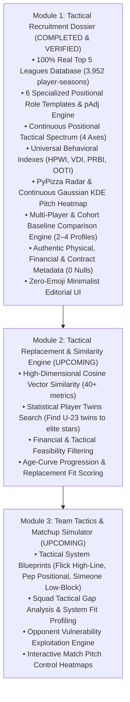

# ScoutBench: Project Roadmap & Future Ideas Tracker

> **Purpose:** This document is the persistent, living master registry for all tactical ideas, analytical models, and data enrichments proposed during development. It ensures we maintain a laser focus on our immediate milestones without losing track of long-term club-grade features.

---

## Active Architecture & Module Roadmap

---

## Running Log of Parked Ideas for Future Exploration

### 1. Advanced Tactical & Spatial Analytics
* **Team-Share & Opportunity Normalization (Attacking pAdj):**
  * Player's percentage share of club's total expected goals (npxG Share %) and shot-creation actions (SCA Share %) to evaluate players carrying weak attacking units.
* **Tactical System Fit Simulation (Module 3 groundwork):**
  * Projecting a player's profile into specific tactical blueprints:
    * *System A: High-Line Counter-Press (Hansi Flick / Jürgen Klopp)*
    * *System B: Positional Play / Rest-Defense (Pep Guardiola / Mikel Arteta)*
    * *System C: Compact Mid-Block Direct Transition (Unai Emery / Diego Simeone)*
* **Expected Threat (xT) Grid Approximations:**
  * Estimating pitch transition value based on progressive carry and pass starting/ending zones.
* **Multi-Competition Slicing:**
  * Domestic League vs. UEFA Champions League / Europa League statistical slicing to separate domestic performers from elite European performers.

---

### 2. Scouting Operations & Export Tools
* **Publication-Grade PDF Dossier Export:**
  * Generate 2-page printable executive scouting summaries for club sporting directors.
* **Scout Shortlist & Watchlist Management:**
  * Tagging players with custom recruitment priority badges (e.g., Target Priority 1, Long-Term Youth Prospect, Contract Opportunist).

---

## Version History & Milestone Tracker
* **v1.0 (Phase 1 Baseline):** Real Top 5 Leagues dataset ingestion, 6 DataMB positional templates, pAdj defense normalization, Streamlit interactive dashboard.
* **v1.1 (Phase 1 Groundwork Upgrade):** Continuous Positional Tactical Spectrum (4 continuous axes), Universal Behavioral Indexes (HPWI, VDI, PRBI, OOTI), Deep Scouting Intelligence cards, and strict 4-card UI hierarchy.
* **v1.2 (Spatial Heatmap Integration):** Continuous Gaussian KDE Pitch Action Heatmaps parameterized by match event depth, box penetration, and lateral width.
* **v2.0 (Recruitment Dossier Finalization & Multi-Player Comparison):**
  * Integrated Transfermarkt financial valuations (€M), contract expiry years, wage tiers, preferred foot, height (cm), weight (kg), and nationality across all 3,952 player-seasons with 0 nulls.
  * Built dynamic Multi-Player Comparison Tool supporting 2–4 players with overlapping Plotly Scatterpolar radars, statistical delta tables, and 4 preset cohort baseline averages (Top 5 Europe, Domestic League, U-21 Europe, U-21 Domestic).
  * Strict zero-emoji minimalist editorial UI overhaul inspired by *The Athletic* and *Opta Pro*.
  * 50/50 unit tests passing with independent victory audit confirmation.
